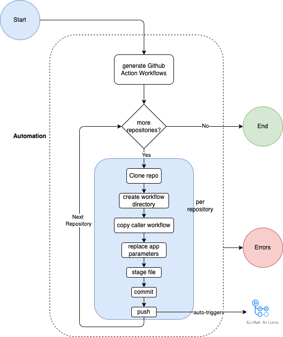

# j2ga - Migrate Jenkins pipeline(s) to GitHub Action workflow(s)

[](https://github.com/aditya-mittal/j2ga/actions/workflows/build.yml)

Migrating Jenkins shared library CI pipelines to Github Actions reusable workflow(s) for one or more GitHub repository. 
- For developer instructions, see the [developer README](DEVELOP.md)

### Schematic representation 


### Sequence Diagram


##### Pre-requisites

- Obtain a GitHub private token as prescribed [here](./README.md#creating-a-private-token-for-github)

```bash
# Example current versions, also known to work with earlier versions
$ node --version
v18.4.0

$ npm --version
8.19.1
```

### Installation

```bash
$ npm run build
```

### Setup config

```bash
# set config
$ cp config/example.yml /path/to/my/config.yml
# update the config with appropriate values

# Set config directory path
$ export NODE_CONFIG_DIR="path-to-directory-containing-config"
# set appropriate config environment
$ export NODE_CONFIG_ENV="your_config_file_name"
```

The `jenkins2githubWorkflowsMap` in config is a mapping of Jenkins shared library template and Github Action 
reusable caller workflow file names.

jenkins2githubWorkflowsMap<key, value>

- key - The Jenkinsfile template name mentioned in your caller Jenkinsfile
- value - The file name for Github Action reusable caller workflow.

e.g.
- key - [JenkinsGradleSharedLibrary](./test/resources/sharedLibJenkinsfile#L3)
- value - [caller-java-gradle-workflow.yml](./test/resources/caller-java-gradle-workflow.yml)
---
### Help

```bash
$ j2ga -h
```

### Generate github action workflows for all repos under specified org

```bash
$ j2ga create-workflows my-github-org
```

### Get github action workflows status for all repos under specified org

```bash
$ j2ga get-workflows-status my-github-org
```

### Clean up

Clean up any installed binary for migration

```bash
$ npm run clean
```

### Limitations

- Does not parses Jenkinsfile entirely and maps that to Github Actions reusable workflow,
rather just interprets kind of Jenkins shared library used and generates its equivalent Github Action Workflow.
- If you have a plain/vanilla Jenkinsfile with no shared pipeline, the generation of its equivalent Github workflow for 
that is currently not possible.
- If your default branch on Github is protected, the push will be rejected

### Creating a private token for GitHub
- Navigate to your [GitHub Personal access tokens](https://github.com/settings/tokens)
- Click `Generate new token`
- Enter some text for `Note` and choose scopes: 
  - `repo` (to configure repositories)
  - `workflow` (to configure github action workflows)
  - `admin:org` (to configure/manage github orgs)
  - `user` (to configure/manage user's data)
- If you have SSO enabled, additionally you may need to authorize the token to be used for a specific org 
- Copy the generated token